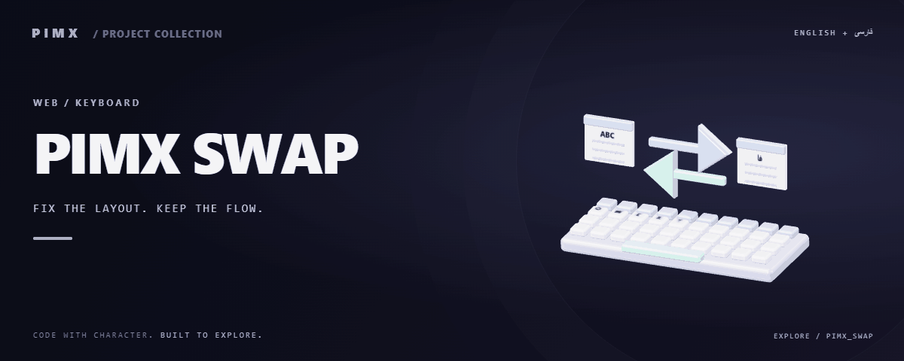

<div align="center">



**[English](README.md) · [فارسی](README.fa.md)**

</div>

# ⌨️ PIMX SWAP

A local Windows keyboard-layout correction utility built with Rust, Tauri 2, React and TypeScript. It reconstructs physical key input and maps it to another layout: `sghl` → `سلام`.

[GitHub](https://github.com/MOHAMMADREZAABEDINPOOR/PIMX_SWAP) · [PIMX / Profile](https://github.com/MOHAMMADREZAABEDINPOOR) · [Static artwork](assets/readme/hero.png)

| At a glance | Details |
|:---|:---|
| ⌨️ Experience | Windows desktop application |
| 🧰 Built with | `React` · `Vite` · `TypeScript` · `Rust` |
| 🌐 Documentation | [English](README.md) · [فارسی](README.fa.md) |

[✨ Features](#features) · [🚀 Getting started](#getting-started) · [⚙️ Configuration](#configuration) · [🌍 Deployment](#deployment)

📖 [Detailed project guide](docs/PROJECT_GUIDE.md)

---

<a id="features"></a>

## ✨ Features

| Area | Included capability |
|:---|:---|
| 🌐 Experience | Auto Fix with local language evidence and a candidate picker |
| ⌨️ Controls | Global shortcuts, native editor and tray lifecycle |
| ⚡ Workflow | Clipboard transactions with restoration checks |
| 🌐 Experience | English/Persian UI, themes and local settings |

<a id="stack"></a>

## 🧰 Stack

| Tool | Version / source |
|---|---|
| React | `^19.1.0` |
| Vite | `^7.1.0` |
| TypeScript | `^5.9.0` |
| Rust | `src-tauri/Cargo.toml` |
| Tauri | `2.x` |

<a id="getting-started"></a>

## 🚀 Getting started

Windows 10/11 x64, WebView2, Node.js 24, stable Rust (MSVC) and Visual Studio C++ Build Tools with Windows SDK.

```bash
git clone https://github.com/MOHAMMADREZAABEDINPOOR/PIMX_SWAP.git
cd PIMX_SWAP

npm ci
npm run icons
npm run tauri dev
```

<a id="configuration"></a>

## ⚙️ Configuration

Configure your layout pair, Auto Fix behavior, global shortcuts, theme, startup and tray behavior in the application Settings. Conversion and language evidence run locally. The keyboard layouts are read from the Windows layout catalog; add a missing layout in Windows Settings, then refresh the catalog.

<a id="usage"></a>

## 🎯 Usage

On Windows, use npm run tauri dev for native integration. Select text and press Ctrl+Shift+Space for Auto Fix; Ctrl+Alt+Shift+Space converts the configured pair and Ctrl+Alt+P opens the editor. Shortcuts are configurable.

<a id="project-structure"></a>

## 🗂️ Project structure

| Path | Role |
|---|---|
| [`assets/`](assets/) | Brand/media/README assets |
| [`docs/`](docs/) | Supporting documentation |
| [`language_profiles/`](language_profiles/) | Local language evidence |
| [`public/`](public/) | Public web assets |
| [`scripts/`](scripts/) | Development and maintenance utilities |
| [`src/`](src/) | Application source |
| [`src-tauri/`](src-tauri/) | Rust native desktop core |
| [`index.html`](index.html) | Project entry/configuration file |
| [`package.json`](package.json) | Project entry/configuration file |
| [`tsconfig.json`](tsconfig.json) | Project entry/configuration file |

<a id="commands-and-checks"></a>

## 🧪 Commands and checks

| Command | Purpose |
|:---|:---|
| `npm run dev` | 🧑‍💻 Development server |
| `npm run build` | 📦 Production build |
| `npm run preview` | 👀 Preview a build |
| `npm run tauri` | 🖥️ Tauri CLI |

```bash
npm run dev
npm run build
npm run preview
npm run test:ui
npm run icons
npm run test:workspace
```

These commands are declared in package.json; the list is not a test execution report. Test commands may need a browser, service or prepared database.

<a id="deployment"></a>

## 🌍 Deployment

scripts/release.ps1 checks/builds the frontend and native core and produces an NSIS installer. See docs/ for release details. Build/release outputs are excluded from the source repository.

<a id="limitations"></a>

## 📌 Limitations

Windows 10/11, WebView2 and native build tools are required. IMEs and arbitrary custom dead-key sequences are not fully reconstructible. Protected/elevated apps may reject replacement; use the editor. Browser preview lacks native integration.

<a id="troubleshooting"></a>

## 🛠️ Troubleshooting

- A reserved shortcut: choose another combination in Settings.
- Missing layout: add it in Windows Settings and refresh the catalog.
- Native features unavailable in a browser: run tauri dev or the compiled executable.

<a id="contributing"></a>

## 🤝 Contributing

Create a focused branch, verify the affected behavior and explain the change clearly. Keep private data, build outputs and local databases out of commits.

Supporting guides:

- [docs/architecture.md](docs/architecture.md)
- [docs/development.md](docs/development.md)
- [docs/PRIVACY.md](docs/PRIVACY.md)
- [docs/validation.md](docs/validation.md)
- [docs/QUICKSTART.md](docs/QUICKSTART.md)
- [docs/release-checklist.md](docs/release-checklist.md)

<a id="license"></a>

## 📄 License

No repository-level license file is included in this snapshot. Public visibility alone does not grant reuse rights; contact the repository owner for terms.

---

Part of **PIMX** · Documentation in English and Persian.

---

<div align="center">

⌨️ **PIMX SWAP** · [English](README.md) · [فارسی](README.fa.md)

</div>
